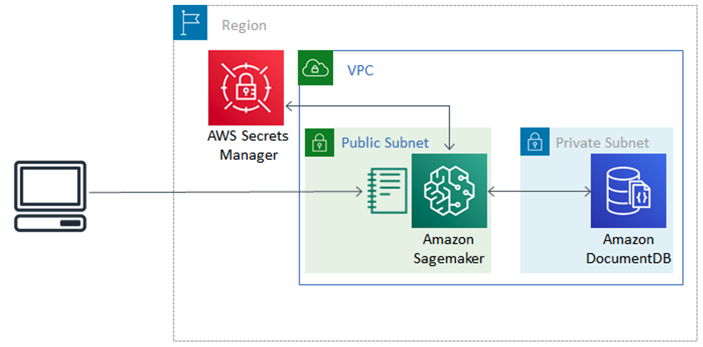

## Query and Write into Amazon DocumentDB using Sagemaker

In our accompanying , we use Amazon SageMaker to analyze data stored in Amazon DocumentDB. After showing how to write queries to conduct a descriptive analysis, we build a simple machine learning model to
make predictions, then we write the prediction results back into the database.

Use the [CloudFormation template](https://github.com/aws-samples/documentdb-sagemaker-example/blob/main/cloudformation.yaml) to create the stack shown below, then load and run the [Jupyter notebook](https://github.com/aws-samples/documentdb-sagemaker-example/blob/main/script.ipynb) in your Sagemaker instance.

## Security

See [CONTRIBUTING](CONTRIBUTING.md#security-issue-notifications) for more information.

## License

This library is licensed under the MIT-0 License. See the LICENSE file.

